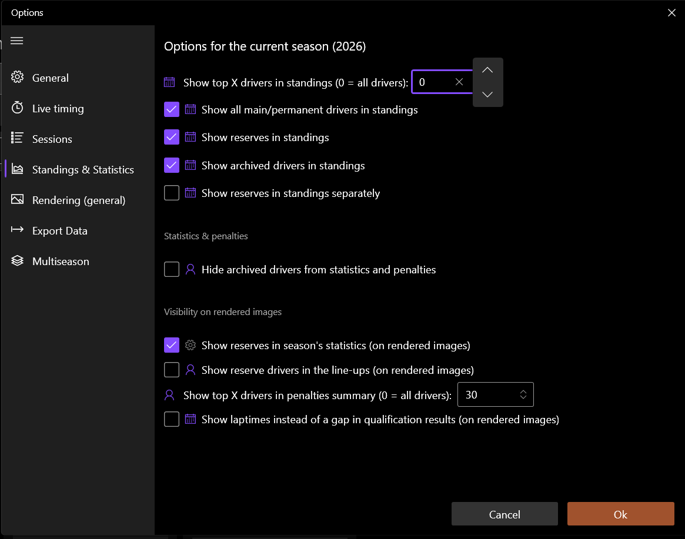

# 2026 FAQ

??? question "How long does it take for the confirmation email to come through after purchase?"
    About an hour.

??? question "Why don't driver names appear when rendering results or lineups?"
    Ensure your app version is v9.8 or higher.

??? question "Team logos aren't showing up on some renders"
    This mostly affects renders that use logotype variants, most often
    Team/Driver Standings and Session Results. Restart the app first. If
    that doesn't fix it, restart your PC or laptop.

??? question "How do you get a discount link or promotion code for the 2026 theme?"
    An email with the subject "F1 2026 Theme Discount" was sent to all 2025 theme
    owners **before** the 9th of April 2026, with the link to the discounted price
    (£14).

??? question "Will the theme have the official driver lineup graphic"
    No. The F1 2025 Theme has this render and there is no significant change
    to the graphic in 2026. The 2025 version will adapt to 2026 championship
    seaons.

??? question "How do I render the full grid or more than 20/22 drivers instead of just the top 10 or one team?"
    Two settings control this together:

    1. **In RLT:** Season → Options → Standings & Statistics → set
       "Show top X drivers in standings" to `0` (0 = all drivers).
       Toggle "Show reserves in standings" and "Show archived drivers
       in standings" here too if you want them counted.
    2. **In the theme:** Theme Options → Driver Global → **Position
       Limit** → set to the number of drivers you want rendered (e.g.
       `22` for a full grid).

    {: width=1165 height=917 loading=lazy }

## Support {: .f1-heading }

--8<-- "buttons-2026.md"
