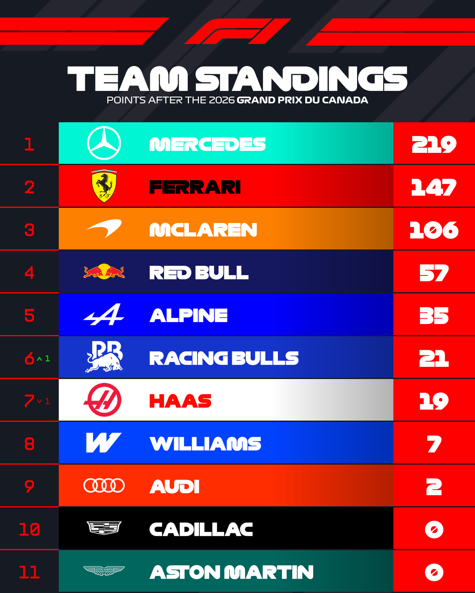

  

    

    

    <svg class="f1-mega-hero-skyline" viewBox="0 0 1200 200" preserveAspectRatio="none">
      <polygon points="0,200 0,150 40,150 40,120 90,120 90,155 140,155 140,100 180,100 180,135 230,135 230,75 260,75 260,60 300,60 300,105 350,105 350,80 400,80 400,125 460,125 460,90 520,90 520,145 580,145 580,65 610,65 610,50 650,50 650,105 700,105 700,150 760,150 760,100 820,100 820,130 870,130 870,70 910,70 910,115 970,115 970,150 1020,150 1020,90 1070,90 1070,140 1120,140 1120,105 1160,105 1160,150 1200,150 1200,200" />
    </svg>
    

    

  

  

    

      

        Pit Lane &middot; <em>Open</em>
        <a class="f1-hero-flag" href="pole-position/" aria-hidden="true" tabindex="-1">🏁</a>
      

      <h1 class="f1-mega-hero-title">Broadcast-grade RLT themes, built to spec.</h1>

      

        Custom themes and layouts for <strong>Racing League Tool (RLT)</strong>, built with the
        Flex Renderer — overlays, standings boards, and broadcast graphics for sim racing
        leagues.
      

      

        <a href="#projects" class="md-button md-button--primary">Explore Themes</a>
        <a href="#a-note-on-timelines-support" class="f1-mega-hero-more">Learn more ↓</a>
      

    

    

      
    

  

  <a class="f1-mega-hero-scroll" href="#projects" aria-hidden="true" tabindex="-1">
    <svg viewBox="0 0 24 24" width="20" height="20" fill="none" stroke="currentColor" stroke-width="2" stroke-linecap="round" stroke-linejoin="round"><path d="M12 5v14M5 12l7 7 7-7"/></svg>
  </a>

Hi, I'm Dark373. I build custom themes and layouts for **Racing League Tool (RLT)**
using the RLT Flex Renderer: overlays, standings boards, and broadcast graphics
for sim racing leagues.

This site documents each of my RLT theme/layout projects: what they include, how
they look, and their current known issues.

!!! warning "Disclaimer"
    None of the themes on this site are affiliated with, endorsed by, or in
    any way officially connected with Formula 1®, Formula One Group, the
    FIA, or any of its subsidiaries or affiliates, nor with any other
    racing series, team, or organisation their layouts may be styled after.
    Names, marks, emblems, and images referenced or visually echoed belong
    to their respective owners. Every theme here is an independent project
    created purely for educational and/or illustrative purposes; any
    resemblance to official graphics is coincidental or intended as a
    tribute to motorsport design, without intent to infringe upon
    trademarks or intellectual property.

## A Note on Timelines & Support {: .f1-heading }

These themes are a one-person effort, fit in around bug fixes, other
releases, and everyday life, so there genuinely isn't a fixed release
date I can give you for what's coming next, and asking repeatedly won't
get you an answer any faster. Most of the time, I don't know either!

Need a hand? Email me, but please check the forum first, since most
questions are already answered there. I read every message, but with
everything else going on, replies can take up to **7 working days**.

<!-- TODO: replace with your real contact email -->
[your-email@example.com](mailto:your-email@example.com)

## Projects {: .f1-heading }

- [2025](f1-2025-theme/index.md): overview, installation, theme options, gallery, and known bugs
- [2026](project-1/index.md): overview, installation, gallery, and known bugs
- [2027](2027/index.md): coming soon
- [Commissions](commissions/index.md): coming soon

More projects will be added here over time.

## Support {: .f1-heading }

--8<-- "buttons.md"

