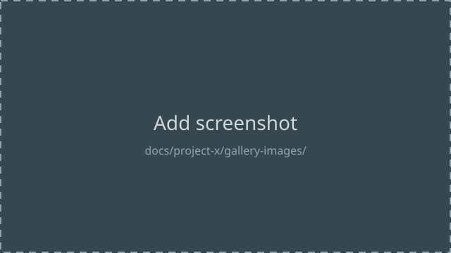

# Project 2 — Gallery

Click any image to zoom in. Replace the placeholders below with real
screenshots once you have them.

!!! tip "Reusable gallery pattern"
    1. Drop your screenshots into `docs/project-2/gallery-images/`.
    2. Replace the placeholder image lines above with your own, e.g.
       ``.
    3. Every image inside a `gallery-grid` div is automatically
       click-to-zoom via glightbox — no extra markup needed.

    This same pattern — a
    `
 ... 
` wrapping one
    Markdown image per line — can be copied into any project's Gallery
    page. The grid layout comes from `docs/stylesheets/extra.css`.
